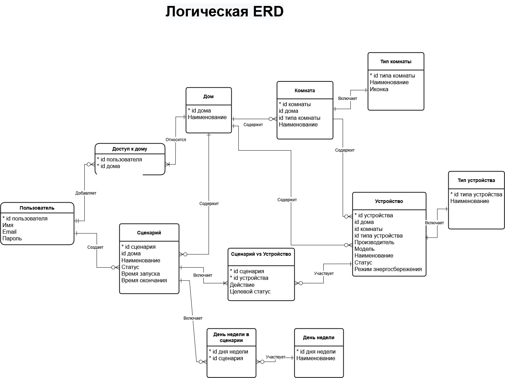

# ERD: модель данных системы умного дома

Пример логической ERD для приложения управления умным домом. Модель описывает пользователей, дома, комнаты, устройства, типы устройств и сценарии автоматизации.

