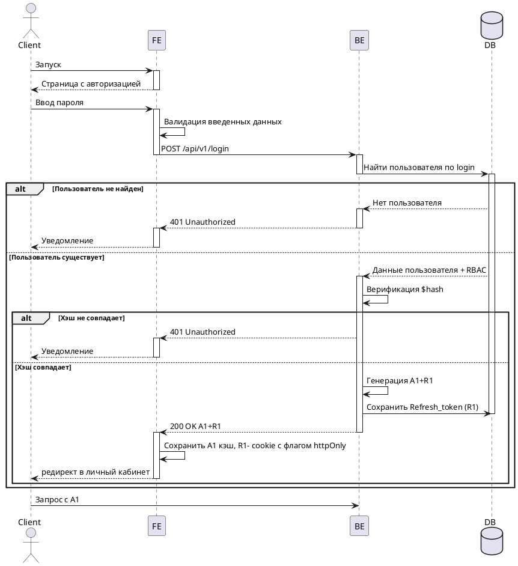

# Sequence: авторизация пользователя

Пример Sequence-диаграммы процесса авторизации пользователя с проверкой учетных данных, обработкой ошибки авторизации и выдачей access/refresh token.

## PlantUML

