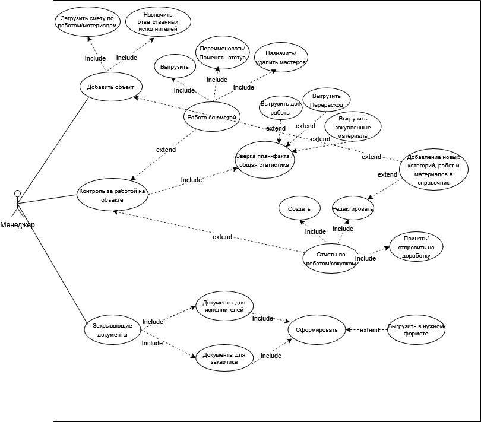

# Use Case: менеджер ERP-системы

Пример диаграммы Use Case для роли менеджера в ERP-системе управления проектами компании по ремонту и строительству.

Диаграмма отражает основные функции менеджера при работе с проектами, сметами, закупками и отчетностью.

## Файлы

- [homyroom-erp-manager-use-case.jpg](homyroom-erp-manager-use-case.jpg) — изображение диаграммы.

